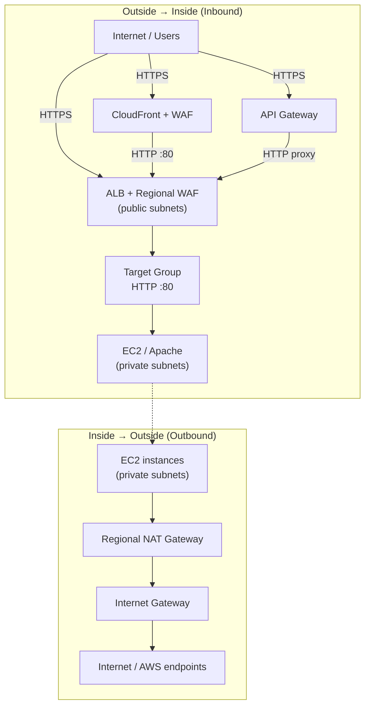

# Paymentology AWS Infrastructure

Terraform project that provisions a multi-tier web application on AWS. The stack includes networking, security groups, an Application Load Balancer (ALB), AWS WAF, CloudFront, API Gateway, Auto Scaling compute, IAM roles, and CloudWatch monitoring with SNS alerts.

## Table of Contents

1. [Setup Prerequisites](#setup-prerequisites)
2. [Architecture Overview](#architecture-overview)
3. [Project Structure](#project-structure)
4. [Variable Explanations](#variable-explanations)
5. [Output Descriptions](#output-descriptions)
6. [Terraform Deployment Commands](#terraform-deployment-commands)
7. [Troubleshooting](#troubleshooting)

---

## Setup Prerequisites

### Required tools

| Tool | Minimum version | Purpose |
|------|-----------------|---------|
| [Terraform](https://developer.hashicorp.com/terraform/install) | `>= 1.5.0` | Infrastructure provisioning |
| [AWS CLI](https://docs.aws.amazon.com/cli/latest/userguide/getting-started-install.html) | v2 recommended | AWS authentication and resource checks |
| Git | Any recent version | Clone and manage the repository |

### AWS account requirements

Before running Terraform locally or in CI, ensure the following exist in your AWS account:

1. **AWS credentials** with permissions to create and manage VPC, EC2, ELB, CloudFront, WAF, API Gateway, IAM, CloudWatch, and SNS resources.
2. **S3 backend bucket** — `sarang-paymentology-bucket` (configured in `backend.tf`).
3. **DynamoDB lock table** — `sarang-paymentology-locks` (prevents concurrent Terraform runs).
4. **ACM certificate** (optional but recommended) — Required for HTTPS on the ALB. Must be in the same region as the ALB (`us-east-1` by default). Set `acm_certificate_arn` in your tfvars file.
5. **SNS email confirmation** — After deployment, confirm the subscription sent to `alert_email` to receive monitoring alerts.

### Remote state

State is stored remotely in S3 with DynamoDB locking:

| Setting | Value |
|---------|-------|
| S3 bucket | `sarang-paymentology-bucket` |
| State key | `paymentology/terraform.tfstate` |
| Region | `us-east-1` |
| Lock table | `sarang-paymentology-locks` |

Terraform workspaces (`dev`, `prod`) share the same backend key but maintain separate state files within the workspace mechanism.

### Configure AWS credentials

**Option A — AWS CLI profile**

```bash
aws configure
# Or set a named profile:
export AWS_PROFILE=your-profile-name
```

**Option B — Environment variables**

```bash
export AWS_ACCESS_KEY_ID="your-access-key"
export AWS_SECRET_ACCESS_KEY="your-secret-key"
export AWS_DEFAULT_REGION="us-east-1"
```

### Clone the repository

```bash
git clone <repository-url>
cd demoproject
```

---

## Architecture Overview

```
Internet
   │
   ├── CloudFront (CDN + WAF)
   │       └── ALB (HTTPS, public subnets)
   │               └── Auto Scaling Group (private subnets)
   │
   └── API Gateway
           └── ALB (proxy integration)
```

### End-to-end flow diagram



### Traffic flow: outside → inside (inbound)

User and client requests enter the VPC from the public internet through three possible paths. All paths eventually reach EC2 instances in **private subnets** via the ALB target group.

**Path 1 — CloudFront (recommended for end users)**

```
Internet (HTTPS)
  → CloudFront edge location
  → WAF (CloudFront scope — managed rule set)
  → ALB in public subnets (HTTP port 80)
  → WAF (Regional scope — attached to ALB)
  → ALB target group (HTTP port 80)
  → EC2 instance in private subnet (Apache httpd on port 80)
```

**Path 2 — Direct ALB access**

```
Internet (HTTPS port 443 or HTTP port 80)
  → ALB in public subnets
  → WAF (Regional scope)
  → ALB target group (HTTP port 80)
  → EC2 instance in private subnet (Apache httpd on port 80)
```

**Path 3 — API Gateway**

```
Internet (HTTPS)
  → API Gateway (Regional REST API, stage = environment name)
  → HTTP proxy integration over the internet
  → ALB DNS name (HTTP port 80)
  → ALB target group
  → EC2 instance in private subnet
```

| Step | Component | Subnet tier | Protocol / port |
|------|-----------|-------------|-----------------|
| 1 | CloudFront / API Gateway / direct client | Edge / regional / internet | HTTPS |
| 2 | WAF (CloudFront or Regional) | Managed service | Inspects request |
| 3 | Application Load Balancer | Public | HTTP :80 (CloudFront origin) or HTTPS :443 (direct) |
| 4 | Target group | — | HTTP :80 |
| 5 | EC2 (Auto Scaling Group) | Private | HTTP :80 (Apache) |

Security groups enforce this path: the ALB security group accepts inbound traffic from the internet; the web security group accepts inbound **only from the ALB security group** on port 80.

---

### Traffic flow: inside → outside (outbound)

Resources inside the VPC reach the internet (and AWS public endpoints) through NAT and the internet gateway. EC2 instances have **no public IP addresses** and cannot be reached directly from the internet.

**Outbound path from EC2 instances (private subnets)**

```
EC2 instance in private subnet
  → Web security group (egress: all traffic allowed)
  → Private route table (0.0.0.0/0 → NAT Gateway)
  → Regional NAT Gateway
  → Internet Gateway (IGW)
  → Internet / AWS public endpoints
```

Typical outbound use cases from web instances:

| Destination | Purpose |
|-------------|---------|
| Amazon Linux yum repositories | `yum update` and package installs during boot (`user_data.sh`) |
| AWS CloudWatch | CloudWatch agent publishes memory and disk metrics |
| Other external APIs | Any future application calls to third-party services |

**Outbound path from database subnets**

Database subnets (when `create_database_subnets = true`) use the same NAT Gateway for outbound traffic. They are isolated from public inbound access and are reserved for future database workloads (e.g. RDS).

```
Database subnet (future RDS)
  → Database route table (0.0.0.0/0 → NAT Gateway)
  → Regional NAT Gateway
  → Internet Gateway
  → Internet
```

**Monitoring and logging (inside → AWS services)**

These flows stay within AWS and do not traverse the public internet path above:

```
VPC Flow Logs        → CloudWatch Logs (via IAM role)
ALB / ASG metrics    → CloudWatch Metrics
CloudWatch Alarms    → SNS topic → alert_email (email confirmation required)
EC2 CloudWatch agent → CloudWatch Metrics (namespace: CWAgent)
```

---

## Project Structure

```
demoproject/
├── main.tf                 # Root module — wires all child modules together
├── variables.tf            # Input variable definitions
├── outputs.tf              # Root output definitions
├── providers.tf            # AWS provider configuration
├── backend.tf              # S3 remote state and provider version constraints
├── environments/
│   ├── dev/terraform.tfvars
│   └── prod/terraform.tfvars
├── modules/
│   ├── networking/
│   ├── security/
│   ├── loadbalancer/
│   ├── waf/
│   ├── cloudfront/
│   ├── api_gateway/
│   ├── compute/
│   ├── iam/
│   └── monitoring/
└── .github/workflows/
    └── terraform.yml       # CI/CD pipeline
```

| Module | Purpose |
|--------|---------|
| `networking` | VPC, subnets, NAT gateways, VPC flow logs |
| `security` | Security groups for ALB and web tier |
| `loadbalancer` | Application Load Balancer and target group |
| `waf` | Web Application Firewall for ALB and CloudFront |
| `cloudfront` | CDN distribution in front of the ALB |
| `api_gateway` | REST API proxy to the ALB |
| `compute` | Launch template and Auto Scaling Group |
| `iam` | Instance profiles and VPC flow log roles |
| `monitoring` | CloudWatch alarms and SNS notifications |

---

## Variable Explanations

All variables are defined in `variables.tf` at the project root. Set values per environment in `environments/<env>/terraform.tfvars` before running `terraform plan` or `terraform apply`.

---

### Core settings

| Variable | Type | Required | Default | Description |
|----------|------|----------|---------|-------------|
| `aws_region` | `string` | Yes | `""` | AWS region for deployment (e.g. `us-east-1`). Used by the AWS provider and API Gateway. |
| `project_name` | `string` | Yes | `""` | Base name prefix for all resources and tags (e.g. `paymentology-dev`). |
| `environment` | `string` | Yes | `""` | Deployment environment label (e.g. `dev`, `prod`). Used for resource tags, API Gateway stage name, and EC2 user data. |

---

### Networking

| Variable | Type | Required | Default | Description |
|----------|------|----------|---------|-------------|
| `vpc_cidr` | `string` | Yes | `""` | CIDR block for the VPC (e.g. `10.20.0.0/16`). Must not overlap with other connected VPCs. |
| `availability_zones` | `list(string)` | Yes | `[]` | List of availability zone names (e.g. `["us-east-1a", "us-east-1b"]`). |
| `az_count` | `number` | Yes | — | Number of AZs to deploy into. Must be less than or equal to `length(availability_zones)`. |
| `public_subnet_cidrs` | `list(string)` | Yes | `[]` | CIDR blocks for public subnets — one per AZ. Hosts the ALB and NAT gateway. |
| `private_subnet_cidrs` | `list(string)` | Yes | `[]` | CIDR blocks for private subnets — one per AZ. Hosts EC2 instances in the Auto Scaling Group. |
| `database_subnet_cidrs` | `list(string)` | Yes | `[]` | CIDR blocks for database subnets — one per AZ. Isolated tier for future RDS use. |
| `create_database_subnets` | `bool` | Yes | — | When `true`, creates database subnets and their route tables. |

---

### Security and TLS

| Variable | Type | Required | Default | Description |
|----------|------|----------|---------|-------------|
| `ingressport` | `number` | Yes | — | Inbound port allowed on the ALB security group from the internet (e.g. `443` for HTTPS). |
| `acm_certificate_arn` | `string` | No | `""` | ACM certificate ARN for the ALB HTTPS listener on port 443. Leave empty to skip the HTTPS listener. |

---

### Compute (Auto Scaling)

| Variable | Type | Required | Default | Description |
|----------|------|----------|---------|-------------|
| `instance_type` | `string` | Yes | `""` | EC2 instance type for web servers (e.g. `t3.micro`). |
| `desired_capacity` | `number` | Yes | — | Target number of running instances in the Auto Scaling Group. |
| `min_size` | `number` | Yes | — | Minimum number of instances the ASG maintains at all times. |
| `max_size` | `number` | Yes | — | Maximum number of instances the ASG can scale up to. |

---

### Monitoring

| Variable | Type | Required | Default | Description |
|----------|------|----------|---------|-------------|
| `alert_email` | `string` | No | `""` | Email address subscribed to the SNS topic for CloudWatch alarms. AWS sends a confirmation email that must be accepted before alerts are delivered. |

---

### Environment-specific values

| Environment | File | Key differences |
|-------------|------|-----------------|
| Dev | `environments/dev/terraform.tfvars` | 2 AZs, VPC `10.20.0.0/16`, project name `paymentology-dev` |
| Prod | `environments/prod/terraform.tfvars` | 3 AZs, VPC `10.30.0.0/16`, project name `paymentology-prod` |

---
## Output Descriptions

After `terraform apply`, the following outputs are available:

| Output | Description |
|--------|-------------|
| `alb_dns_name` | DNS name of the Application Load Balancer. Use this for direct ALB access or DNS CNAME records. |
| `alb_https_url` | Full HTTPS URL to the ALB (`https://<alb-dns-name>`). Returns `null` if `acm_certificate_arn` is not set. |
| `cloudfront_domain_name` | CloudFront distribution domain name (e.g. `d1234abcd.cloudfront.net`). |
| `cloudfront_url` | Primary public HTTPS URL via CloudFront (`https://<cloudfront-domain>`). Recommended entry point for end users. |
| `api_gateway_url` | Invokable API Gateway URL including the `index.html` path segment. Useful for API-based access to the application. |
| `vpc_id` | ID of the created VPC. Reference this when adding peering, VPN, or additional resources in the same VPC. |

Example:

```bash
$ terraform output

alb_dns_name          = "paymentology-dev-alb-123456789.us-east-1.elb.amazonaws.com"
alb_https_url         = "https://paymentology-dev-alb-123456789.us-east-1.elb.amazonaws.com"
api_gateway_url       = "https://abc123.execute-api.us-east-1.amazonaws.com/dev/index.html"
cloudfront_domain_name = "d111111abcdef8.cloudfront.net"
cloudfront_url        = "https://d111111abcdef8.cloudfront.net"
vpc_id                = "vpc-0abc123def456789"
```

---

## Terraform Deployment Commands

All commands below assume you are in the project root (`demoproject/`).

### 1. Initialize Terraform

Downloads providers and configures the remote S3 backend:

```bash
terraform init -upgrade
```

For local validation only (no remote state):

```bash
terraform init -upgrade -backend=false
```

### 2. Select or create a workspace

Workspaces isolate state per environment (`dev` and `prod`):

```bash
# Development
terraform workspace select -or-create dev

# Production
terraform workspace select -or-create prod
```

### 3. Validate configuration

```bash
terraform fmt -check
terraform validate
```

### 4. Plan changes

Review the execution plan before applying:

```bash
# Dev environment
terraform plan -var-file=environments/dev/terraform.tfvars -out=tfplan

# Prod environment
terraform plan -var-file=environments/prod/terraform.tfvars -out=tfplan
```

### 5. Apply changes

Apply a saved plan (recommended):

```bash
terraform apply tfplan
```

Or apply directly :

```bash
terraform apply -var-file=environments/dev/terraform.tfvars
```

### 6. View outputs

After a successful apply:

```bash
terraform output
```

Show a specific output:

```bash
terraform output cloudfront_url
```

### 7. Destroy infrastructure

**Warning:** This permanently removes all managed resources.

```bash
terraform workspace select dev
terraform destroy -var-file=environments/dev/terraform.tfvars
```

### Quick reference — full dev deployment

```bash
terraform init -upgrade
terraform workspace select -or-create dev
terraform plan -var-file=environments/dev/terraform.tfvars -out=tfplan
terraform apply tfplan
terraform output
```

### CI/CD (GitHub Actions)

The workflow in `.github/workflows/terraform.yml` automates validation and deployment.

| Trigger | Behavior |
|---------|----------|
| Pull request to `dev` or `main` | Runs `init`, `validate`, and `plan` |
| Manual workflow dispatch | Choose environment (`dev` / `prod`) and action (`plan` / `apply` / `destroy`) |

Required GitHub secrets:

- `AWS_ACCESS_KEY_ID`
- `AWS_SECRET_ACCESS_KEY`
- `AWS_DEFAULT_REGION`

Manual `apply` and `destroy` actions require approval through the configured GitHub Environment (`dev` or `prod`).

---

## Troubleshooting

| Issue | Suggested fix |
|-------|---------------|
| `Error acquiring the state lock` | Another process holds the lock. Wait for it to finish, or inspect the DynamoDB lock table if a run was interrupted. |
| SNS alerts not received | Confirm the subscription email sent to `alert_email` after the first apply. |
| HTTPS listener not created | Set a valid `acm_certificate_arn` in your tfvars file. The certificate must be issued and in the same region as the ALB. |
| `terraform plan` shows unexpected changes | Ensure the correct workspace and tfvars file are selected for your target environment. |
