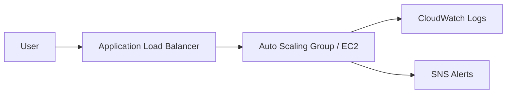

# Architecture Overview

This project follows a layered AWS architecture:

1. Internet-facing Application Load Balancer in public subnets.
2. Auto Scaling Group of EC2 instances in private subnets.
3. Optional database subnets reserved for future stateful services.
4. CloudWatch logs and SNS alerts for observability.

